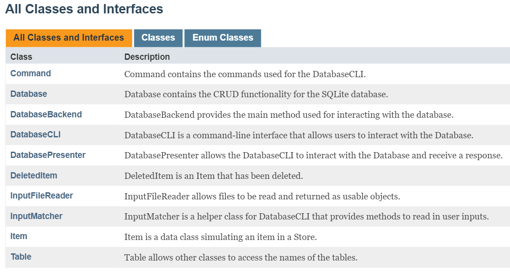
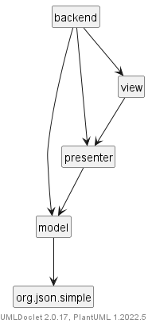
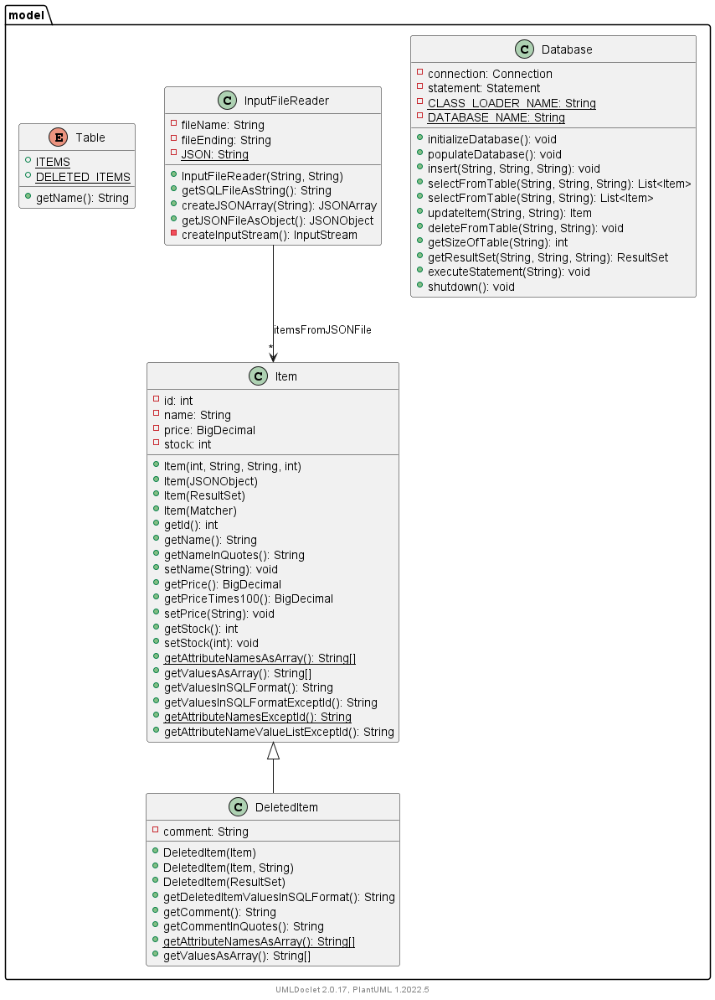
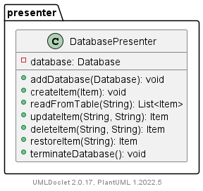
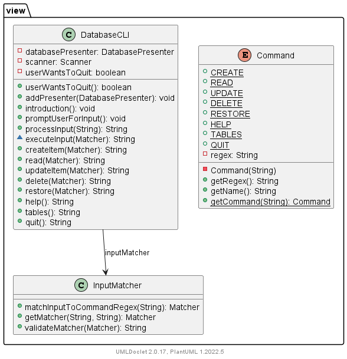
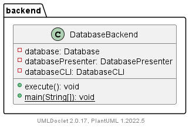

# Sample CRUD Database

A project for Shopify's Fall 2022 Backend Engineer Intern Challenge. This project involves independently creating a simple CRUD application. The additional requirement satisfied for the challenge is: `When deleting, allow deletion comments and undeletion`.

## How to Use

This application prepared to run with an online IDE called `Replit.` See the [Replit Instructions](#replit-instructions) section for details.

Instructions on how to run the app from terminal are provided in [General Instructions](#general-instructions).

### Replit Instructions

[](https://replit.com/@liamtripp/Sample-CRUD-Backend)

The badge above directs the user to the app on Replit. Once there, click the large green button. The app will ask in the `Console` tab for user confirmation before proceeding. Various packages will be downloaded before the application begins. 

See [Application Commands](#application-commands) for the available commands in the application. See [Console Commands](#console-commands) for commands to interact with the console.

### General Instructions

The app requires at least [JDK 17](https://www.oracle.com/java/technologies/downloads/) and [Maven](https://maven.apache.org/download.cgi) 3.8.x to run. [Graphviz](https://graphviz.org/download/) must also be installed for a plugin this app uses. Once those are installed, the app can be run manually by executing the two commands below in a terminal navigated to the project's folder. To navigate in terminal to the project's folder, obtain the full file path to the project folder, and enter `cd filePathToProjectFolder` in terminal. Click [here](https://en.wikipedia.org/wiki/Cd_(command)#Usage) for more information about what `cd` is. For more details about the commands see [Maven Commands](#maven-commands)).

```mvn clean install```

```mvn compile exec:java```

### Application Commands

These commands can be used while the application is running. They are case-insensitive. The square brackets should be omitted.

* `CREATE [name] [dollar.cents] [stock]` - insert a row into the table `items`. The attribute `name` must be one word with alphanumeric characters

* `READ [tableName]` - view the rows from one of the following tables: `items`, `deleted_items`

* `UPDATE [id] [columnName] = [value]` - update a value corresponding to a column name in the table items. Text values must be quoted like 'this' (ex: `update name = 'GreenFresh'`)

* `DELETE [id] [optionalComment]` - delete a row in the table `items` while providing an optional comment

* `RESTORE [id]` - restores a row with the provided id to its corresponding table

* `HELP` - view the list of valid commands

* `TABLES` - view the list of tables

* `QUIT` - exit the application

Note that the `UPDATE` command is limited to updating one value on one item at a time.

### Maven Commands 

These commands interact with the application itself. They can be run on any operating system from the terminal navigated to the project folder. On Replit, the console is already in the project folder and the first two commands below are done automatically with the green 'run' button.

* `mvn clean install` - download the packages for the app to Replit
* `mvn compile exec:java` - execute the application
* `mvn test` - run the app's unit tests

### Console Commands

These commands are meant for a Linux terminal. Note that `file` refers to `java`, `javac`, or `mvn`.

* `Ctrl+C` (keyboard) - cancel a process in action
* `kill 1` - restart the application
* `[file] -version` - check the version of a file, without the brackets
* `command -v [file]` - check the filepath of a file, without the brackets

## Design

### Overview

This application simulates an online store manager. It lacks integration as a web application as it does not use an online server. My experience with less strict languages like JavaScript and Python is limited to scripting. I chose to simulate a web application using a Java command-line interface. For the database, I used [SQLite](https://github.com/xerial/sqlite-jdbc) for its ability to be embedded within the application. 

The architectural design pattern used for the GUI is [Model-View-Presenter](https://en.wikipedia.org/wiki/Model%E2%80%93view%E2%80%93presenter). This separates responsibilities for different functions among different classes.

See [Classes](#classes) for more details on how the application is designed. See [Tests](#tests) for descriptions of the unit tests performed. See [Technologies](#technologies) for some plugins used.

<details>
  <summary><b>Show Design Details</b></summary>
<br>

### Details

The method to run this application is found in the file `DatabaseBackend`. It begins a loop that prompts the user for input in the form of a [Command](#application-commands) and displays an appropriate output. This loop continues until the user enters `QUIT`.

The tables for this project are `items` and `deleted_items`. Both contain `Items`, which each have an id, name, price, and stock. Id is specified by the SQL database. `DeletedItem`, a subclass of Item, may contain an optional comment.

When an Item is deleted from a table using the `DELETE` Command, it is inserted into the `deleted_items` table. The `RESTORE` Command deletes the item from the `deleted_items` table, returning the DeletedItem to its original table as an item.

Commands are processed by pattern-matching and group capturing with Regex. The captured input groups are passed and formatted for the SQL database before being executed. The Regex group capturing limits the application to whatever is hard-coded. It favors security by disallowing input that doesn't match the required format. 

### Classes

Class descriptions and UML class diagrams are provided for an overview of the system. They were generated using the [UMLDoclet](https://github.com/talsma-ict/umldoclet) plugin (more details under [Technologies](#technologies)).

#### Class Descriptions

All classes and almost all methods are fully documented. Below are the class descriptions.



#### Package Dependencies

This diagram illustrates the relationship between the application's packages. `org.json.simple` is a [dependency](#technologies).



### UML Class Diagrams

The packages for the project are divided amongst the `view`, `presenter`, and `model` per the Model-View-Presenter pattern. `backend` contains the main method.

<br>
<details>
  <summary><b>Show Package Diagrams</b></summary>

#### Model

The `model` package contains the main Model class, `Database`. It also contains the `Item` classes, an [enumeration](https://en.wikipedia.org/wiki/Enumerated_type) for the names of the SQL tables (accessed by all packages), and `InputFileReader` to read files used for initializing the Database and testing. 



#### Presenter

The `presenter` package only contains the main Presenter class, `DatabasePresenter`. In hindsight, DatabasePresenter could have contained methods to format input Strings for the View and returned Strings instead of returning `Items`.



#### View
  
The `view` package contains the main View class, `DatabaseCLI`, as well as a [Command](#application-commands) enumeration and InputMatcher helper class.



#### Backend

Backend creates the `Database`, `DatabasePresenter`, and `DatabaseCLI` before beginning the input loop.



</details>
</details>
  
## Resources

* `DDL.sql` - contains the SQL statements used to define the database schema
* `items.json` - contains the information used to populate the table `items`
* `testUserInputs.json` - contains valid and invalid inputs that a user might enter. Used for testing with `CommandTest` (see below)

## Tests

Rigorous unit testing was used throughout development to verify application functions. Below are descriptions of the test files.

 * `DatabaseTest` ensures the Database's CRUD methods work properly
 * `DatabasePresenterTest` ensures the DatabasePresenter's CRUD methods work properly with the Database
 * `DatabaseCLITest` ensures that DatabaseCLI's CRUD methods work properly with the DatabasePresenter
 * `CommandTest` ensures that Command's search method work properly with the inputs found in `testUserInputs.json`
 * `ItemTest` ensures that Item's price conversion methods work properly
 * `InputFileReaderTest` ensures that inputs files are read properly

## Technologies

As this project is managed with [Maven](https://maven.apache.org/), the plugins and dependencies used are contained in the file `pom.xml`. Alternatively, an up-to-date list of dependencies can be found [on GitHub](https://github.com/cyberphoria/Sample-CRUD-Backend/network/dependencies). However, it does not include plugins.

If the user is running the application with the [General Instructions](#general-instructions), full API documentation including UML class diagrams can be generated using UMLDoclet. UMLDoclet is not included in the Replit.

To use UMLDoclet, [Graphviz](https://graphviz.org/download/) must be installed. To activate it, run `mvn install` in terminal. The documents generated are located in the folder `target/apidocs`.

* [SQLite](https://github.com/xerial/sqlite-jdbc) - a relational database that is self-contained, meaning it does not require as much client-server configuration as MySQL or PostgreSQL
* [JSONSimple](https://github.com/fangyidong/json-simple) - JSON file manipulation
* [UMLDoclet](https://github.com/talsma-ict/umldoclet) - generates interactive Javadoc pages and UML Class Diagrams for packages. It is executed when the user runs ```mvn install```

## Takeaways 

Overall, I am satisfied with this project. It would be interesting to do a similar application with more frontend technologies.

The reader should note that this project demonstrates the following: 

* Thorough technical and user documentation
* Written communication skills
* Emphasis on unit testing to verify application functions
* Knowledge of SQL
* Application of design patterns (specifically, [Model-View-Presenter](https://en.wikipedia.org/wiki/Model%E2%80%93view%E2%80%93presenter))
* Error detection and handling
* Coding and development style
* Knowledge of GitHub and Markdown
